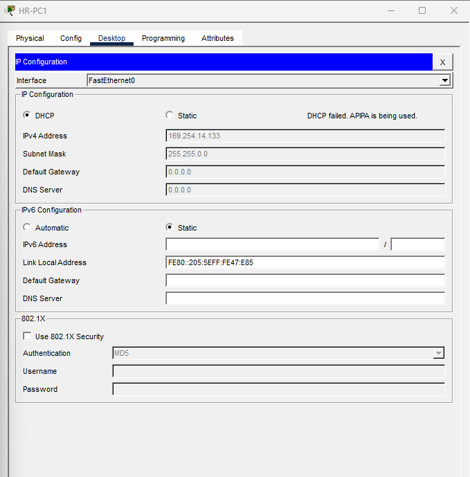
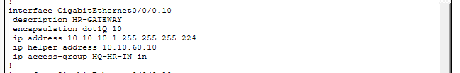
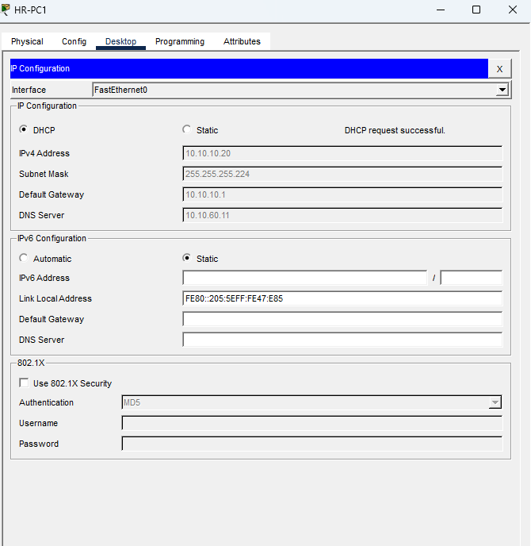
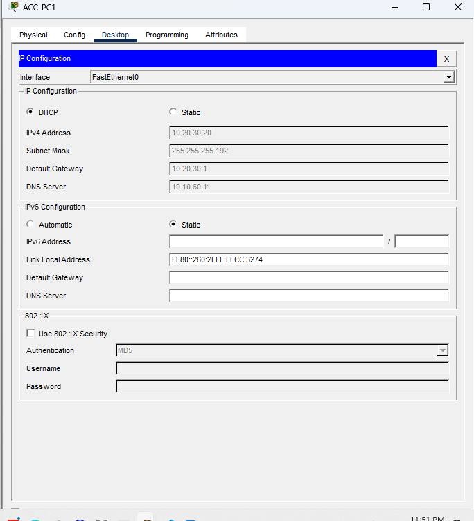
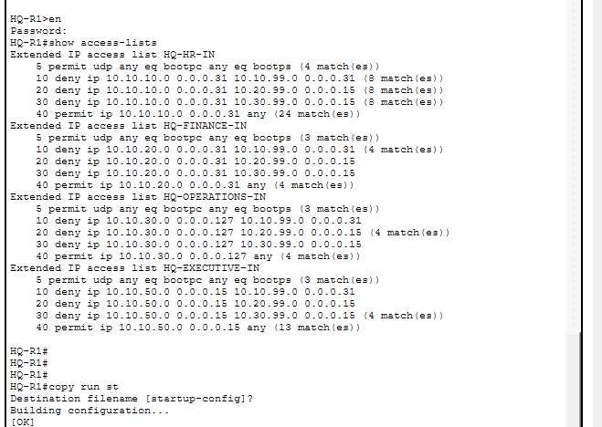
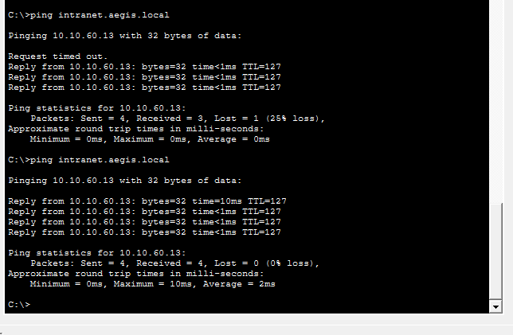
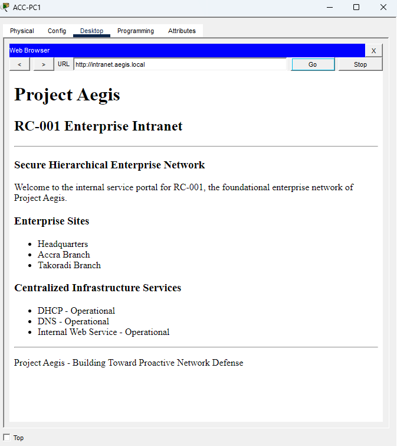

# RC-001 — M9 Infrastructure Services Verification Report

**Project:** RC-001 — Secure Hierarchical Enterprise Network  
**Portfolio:** Project Aegis  
**Milestone:** M9 — Enterprise Infrastructure Services  
**Status:** COMPLETE — VERIFIED  
**Checkpoint:** RC-001-v0.6  

---

## 1. Objective

M9 extended the RC-001 enterprise network from a secured routed
infrastructure into an environment providing centralized enterprise
services.

The milestone investigated whether centralized infrastructure services
could be introduced across a multi-site routed environment while
preserving the routing, segmentation, and management-plane security
controls established during previous milestones.

The primary engineering question was:

> Can centralized DHCP, DNS, and internal application services be
> delivered across Headquarters, Accra, and Takoradi without weakening
> existing network-security controls?

---

## 2. Existing Infrastructure

M9 was implemented on the validated M8 network.

The environment consisted of:

- Headquarters
- Accra Branch
- Takoradi Branch
- VLAN-based network segmentation
- Inter-VLAN routing
- Multi-site OSPF routing
- Dedicated management networks
- SSHv2 management hardening
- Extended ACL-based management-plane segmentation

The validated M8 checkpoint was retained before M9 changes were introduced.

---

## 3. Centralized Service Architecture

Infrastructure services were centralized within the Headquarters server
network.

| Server | IP Address | Role |
|---|---|---|
| AD-SRV | 10.10.60.10 | Centralized DHCP |
| DNS-SRV | 10.10.60.11 | Internal DNS |
| FILE-SRV | 10.10.60.12 | Internal File Service |
| WEB-SRV | 10.10.60.13 | Internal Web/Intranet Service |
| BACKUP-SRV | 10.10.60.14 | Backup Infrastructure |

The server network uses static addressing.

Management networks and infrastructure interfaces also remain statically
addressed.

---

# 4. Centralized DHCP

## 4.1 Design

AD-SRV at `10.10.60.10` was configured as the centralized DHCP server.

DHCP was provided to end-user VLANs at Headquarters, Accra, and Takoradi.

Because DHCP Discover traffic is broadcast traffic and does not normally
cross routed boundaries, DHCP relay was configured on the appropriate
router interfaces using:

```text
ip helper-address 10.10.60.10

This allowed branch and HQ VLAN DHCP requests to be forwarded to the
centralized DHCP server.

## 4.2 Initial DHCP Failure

The first controlled DHCP deployment was performed on the Headquarters HR
VLAN.

HR-PC1 failed to obtain a DHCP lease and assigned itself an APIPA address
in the 169.254.0.0/16 range.

This produced the first M9 troubleshooting investigation.

Observed Result
DHCP request → FAILED
Fallback     → APIPA

## 4.3 Troubleshooting Methodology

The failure was investigated incrementally.

Check 1 — DHCP Relay

The HR router subinterface was inspected.

The required relay configuration was present:

ip helper-address 10.10.60.10

Result: PASS

Check 2 — DHCP Server Reachability

HQ-R1 successfully reached:

10.10.60.10

using ICMP.

Result: PASS

These tests indicated that neither basic routing nor DHCP relay
configuration was the primary problem.

## 4.4 Root Cause

Inspection of the M8 inbound ACL revealed the interaction responsible for
the failure.

The HR VLAN was protected by an inbound extended ACL designed to restrict
ordinary user access to management networks.

Before obtaining an address, however, a DHCP client originates its initial
DHCP traffic without an address belonging to the configured HR subnet.

Therefore, the initial DHCP traffic did not match the existing
source-network permit rule and was blocked by the ACL policy.

This demonstrated an important interaction between a previously validated
security control and a newly introduced infrastructure service.

## 4.5 Corrective Action

A narrowly scoped DHCP exception was introduced before the existing ACL
security rules:

permit udp any eq bootpc any eq bootps

The objective was to permit DHCP bootstrap traffic without providing
general unrestricted access around the M8 management-plane controls.

After applying the change, HR-PC1 successfully obtained:

IPv4 Address:    10.10.10.20
Subnet Mask:     255.255.255.224
Default Gateway: 10.10.10.1
DNS Server:      10.10.60.11

Result: PASS


# 5. Multi-Site DHCP Verification

After successful controlled testing on the HR VLAN, centralized DHCP was
extended to the remaining intended user VLANs.

DHCP relay was configured where required on:

HQ-R1
ACC-R1
TAK-R1

Branch DHCP requests therefore followed the logical path:

Client
  ↓
Local VLAN
  ↓
Branch Router
  ↓
DHCP Relay
  ↓
OSPF-Routed WAN
  ↓
Headquarters
  ↓
AD-SRV

## 5.1 Accra Verification

ACC-PC1 successfully received:

IPv4 Address:    10.20.30.20
Subnet Mask:     255.255.255.192
Default Gateway: 10.20.30.1
DNS Server:      10.10.60.11

The client subsequently reached:

Local default gateway
AD-SRV at 10.10.60.10
DNS-SRV at 10.10.60.11

Result: PASS

## 5.2 Takoradi Verification

Takoradi Operations successfully obtained centralized DHCP configuration
through TAK-R1.

Verification confirmed reachability to:

Local default gateway
AD-SRV at 10.10.60.10
DNS-SRV at 10.10.60.11

Result: PASS

## 5.3 IT VLANs

The Accra and Takoradi IT VLANs were also migrated to centralized DHCP.

Both successfully received addressing from AD-SRV.

Result: PASS


# 6. DHCP Security Regression Testing

After introducing DHCP exceptions, the M8 security controls were retested.

The objective was to determine whether allowing DHCP bootstrap traffic had
unintentionally weakened management-plane segmentation.

Unauthorized Tests

The following representative user networks were tested against protected
management networks:

Headquarters HR
Accra Operations
Takoradi Operations

Expected:

Unauthorized User → Management = BLOCK

Observed:

Unauthorized User → Management = BLOCK

Result: PASS

Authorized Tests

Authorized IT clients were tested against management infrastructure.

Expected:

Authorized IT → Management = ALLOW

Observed:

Authorized IT → Management = ALLOW

Result: PASS

## 6.1 ACL Counter Evidence

Router ACL counters were inspected after testing.

The counters demonstrated activity on:

DHCP permit entries
Management-network deny entries
Existing legitimate-traffic permit entries

This provided device-side evidence that DHCP traffic was being permitted
while management restrictions continued to process prohibited traffic.


# 7. Centralized DNS
## 7.1 DNS Architecture

DNS-SRV:

10.10.60.11

was configured as the centralized internal DNS service.

DHCP pools distributed 10.10.60.11 as the DNS server to dynamically
configured clients.

The internal namespace used for M9 was:

aegis.local

# 7.2 DNS Records

The following records were created:

Hostname	Address
ad.aegis.local	10.10.60.10
dns.aegis.local	10.10.60.11
files.aegis.local	10.10.60.12
intranet.aegis.local	10.10.60.13
backup.aegis.local	10.10.60.14

## 7.3 DNS Verification

Name resolution was tested from:

Headquarters
Accra
Takoradi

Representative tests included:

ping intranet.aegis.local
ping files.aegis.local
ping dns.aegis.local

The names resolved to the expected addresses and the corresponding hosts
were reachable.

Result: PASS

A nonexistent hostname was also tested.

Expected:

No DNS resolution

Observed:

No DNS resolution

Result: PASS

This provided both positive and negative DNS verification.


# 8. Internal Application Service

WEB-SRV at:

10.10.60.13

was configured to provide an internal web service.

DNS mapped:

intranet.aegis.local

to WEB-SRV.

The default page was replaced with a customized Project Aegis / RC-001
internal portal.

## 8.1 Multi-Site HTTP Verification

The internal portal was accessed using:

http://intranet.aegis.local

from:

Headquarters
Accra
Takoradi

The customized page loaded successfully from all three locations.

Result: PASS

This verified the complete service chain:

DHCP Client Configuration
          ↓
Centralized DNS
          ↓
Hostname Resolution
          ↓
OSPF Routing
          ↓
HQ Server Network
          ↓
WEB-SRV
          ↓
HTTP Application

# 9. Final Acceptance Testing

Representative final acceptance tests included:

ID	Test	Expected	Result
DHCP-01	HQ client receives centralized DHCP	Success	PASS
DHCP-02	Accra client receives centralized DHCP	Success	PASS
DHCP-03	Takoradi client receives centralized DHCP	Success	PASS
DNS-01	HQ resolves internal hostname	Success	PASS
DNS-02	Accra resolves internal hostname	Success	PASS
DNS-03	Takoradi resolves internal hostname	Success	PASS
DNS-04	Nonexistent hostname	No resolution	PASS
WEB-01	HQ accesses intranet by hostname	Success	PASS
WEB-02	Accra accesses intranet by hostname	Success	PASS
WEB-03	Takoradi accesses intranet by hostname	Success	PASS
SEC-01	HQ unauthorized user → management	Block	PASS
SEC-02	Accra unauthorized user → management	Block	PASS
SEC-03	Takoradi unauthorized user → management	Block	PASS
SEC-04	Authorized IT → management	Allow	PASS
ROUTE-01	OSPF routes remain operational	Success	PASS

# 10. Verification Evidence

The following screenshots provide representative evidence from the M9
implementation, troubleshooting, and verification process.

## 10.1 Initial DHCP Failure

HR-PC1 initially failed to obtain a DHCP lease and fell back to an APIPA
address in the `169.254.0.0/16` range.



**Evidence:** DHCP service was not initially operational for the HR VLAN.

---

## 10.2 DHCP Relay and ACL Investigation

Inspection of the HR gateway configuration confirmed that the DHCP relay
was present while the existing M8 inbound security ACL remained applied.



**Evidence:** The investigation focused on the interaction between DHCP
bootstrap traffic and the existing inbound security policy.

---

## 10.3 HQ DHCP Recovery

After introducing the narrowly scoped DHCP exception, HR-PC1 successfully
obtained a valid enterprise address, default gateway, and centralized DNS
configuration.



**Evidence:** Centralized DHCP functionality was restored without removing
the existing security ACL.

---

## 10.4 Cross-Site DHCP Verification

ACC-PC1 successfully obtained its addressing information from the
centralized DHCP infrastructure at Headquarters.



**Evidence:** DHCP relay successfully supported a remote branch across the
routed enterprise network.

---

## 10.5 Security Regression Evidence

ACL counters recorded matches against both the DHCP bootstrap permit rules
and existing management-network deny rules.



**Evidence:** DHCP functionality was introduced while the M8
management-plane restrictions continued to process and block prohibited
traffic.

---

## 10.6 Centralized DNS Verification

The internal hostname `intranet.aegis.local` successfully resolved to
`10.10.60.13`, followed by successful communication with the destination.



**Evidence:** Internal DNS resolution was operational using the centralized
DNS infrastructure.

---

## 10.7 Internal Application Verification

The customized RC-001 enterprise intranet was successfully accessed from
ACC-PC1 using the DNS hostname `http://intranet.aegis.local`.



**Evidence:** DHCP, DNS, routing, and HTTP services operated together to
provide a functional cross-site enterprise application service.

# 11. Key Engineering Finding

The most significant finding during M9 was not simply that centralized
DHCP worked.

It was that introducing a legitimate infrastructure service created an
unexpected interaction with a previously validated security control.

The original M8 ACL policy correctly enforced management-plane
segmentation but did not initially accommodate DHCP bootstrap behavior.

The resulting failure required:

Observe Failure
      ↓
Verify Relay
      ↓
Verify Reachability
      ↓
Inspect Security Policy
      ↓
Identify Root Cause
      ↓
Introduce Narrow Exception
      ↓
Retest DHCP
      ↓
Regression-Test Security

The final solution preserved both service availability and the existing
least-privilege security objective.

# 12. Limitations

M9 was implemented within Cisco Packet Tracer and therefore inherits the
limitations of the simulation environment.

The milestone demonstrates infrastructure-service architecture and
network behavior within the modeled environment; it should not be
interpreted as equivalent to production deployment of enterprise DHCP,
DNS, directory, web, or security infrastructure.

Further work in later Project Aegis research cases may reproduce similar
architectures using environments that provide richer logging, telemetry,
security monitoring, and adversarial testing capabilities.

# 13. Final Result

M9 — Enterprise Infrastructure Services: VERIFIED

The milestone successfully introduced:

Centralized DHCP
Multi-site DHCP relay
Centralized DNS
Internal DNS namespace
Internal web/application service
Cross-site service availability
Security regression verification
ACL counter evidence

while preserving:

OSPF routing
VLAN segmentation
Management-plane restrictions
Authorized IT management access
Existing legitimate enterprise connectivity