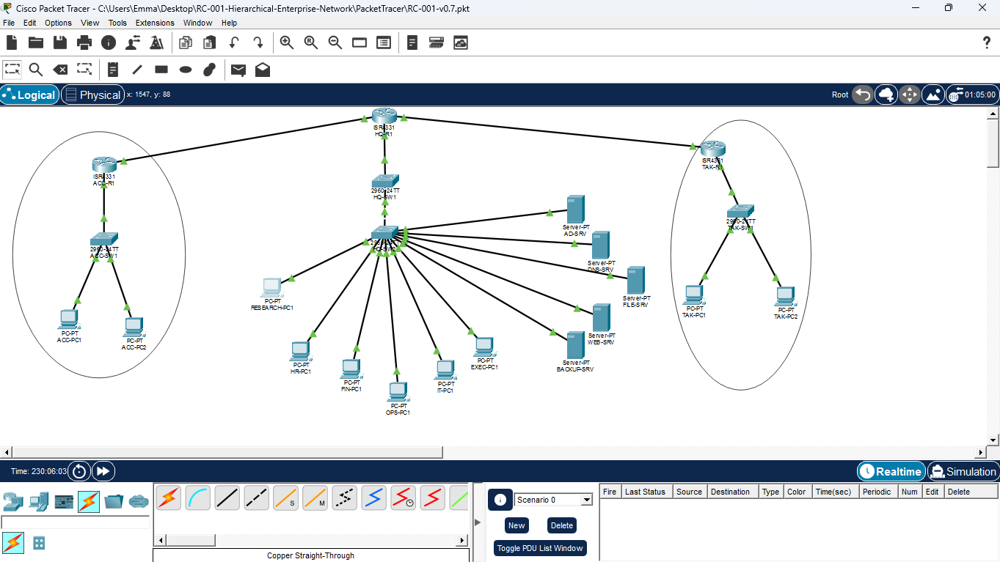

# RC-001 — Secure Hierarchical Enterprise Network

> **Foundation Project of Project Aegis**  
> **Building Toward Proactive Network Defense**

RC-001 is a research-oriented network engineering project focused on the
design, implementation, security hardening, and systematic verification of
a multi-site enterprise network.

The project forms the infrastructure foundation of **Project Aegis**, a
multi-project research and engineering portfolio exploring the progression
from secure network architecture toward observable, measurable, and
increasingly proactive cyber defense.

## Current RC-001 Topology



*Current multi-site RC-001 implementation connecting Headquarters, Accra, and Takoradi.*


---


## Project Status

**Current Status: RC-001 Complete — Final Engineering and Experimental Validation Completed**

| Milestone | Engineering Focus | Status |
|---|---|---|
| M1 | Repository & Engineering Foundation | ✅ Complete |
| M2 | Physical Enterprise Architecture | ✅ Complete |
| M3 | VLAN Segmentation | ✅ Complete |
| M4 | IEEE 802.1Q Trunking | ✅ Complete |
| M5 | Inter-VLAN Routing | ✅ Complete |
| M6 | OSPF Dynamic Routing | ✅ Complete |
| M7 | SSHv2 Management Hardening | ✅ Complete |
| M8 | ACL-Based Security Segmentation | ✅ Complete |
| M9 | Enterprise Infrastructure Services | ✅ Complete |
| M10 | Experimental Validation & Project Closeout | ✅ Complete |

**RC-001 Status: COMPLETE**


## Research / Engineering Question

**How can a multi-site enterprise network be designed, progressively
hardened, and systematically validated while preserving required business
connectivity?**

RC-001 approaches this question through iterative engineering milestones,
controlled configuration changes, positive and negative testing, and
version-controlled technical documentation.

---

## Network Architecture

RC-001 models a geographically distributed enterprise consisting of:

- Headquarters (HQ)
- Accra Branch
- Takoradi Branch

Headquarters provides the primary enterprise infrastructure, including
departmental user networks, server infrastructure, network management, and
WAN connectivity to the branch sites.

The branch networks provide local user connectivity while dynamically
exchanging routes with HQ.

### Current Architecture

```text
                         HEADQUARTERS
                              |
                    Enterprise Core Routing
                              |
             +----------------+----------------+
             |                                 |
         Accra Branch                    Takoradi Branch

The detailed topology is implemented and tested in Cisco Packet Tracer.


## Engineering Objectives

### RC-001 was designed to:

- Build a structured multi-site enterprise network.
- Segment users and infrastructure using VLANs.
- develop a scalable IPv4 addressing architecture.
- Implement IEEE 802.1Q trunking.
- Provide inter-VLAN routing.
- Establish dynamic multi-site routing using OSPF.
- Separate infrastructure management traffic from user traffic.
-  Harden remote network-device administration using SSHv2. 
- Apply least-privilege access controls to the management plane.
- Preserve legitimate business connectivity while enforcing security policy.
- Validate network behavior using repeatable positive and negative tests.
- Document engineering decisions, troubleshooting, limitations, and results.


###  Technologies Implemented
Technology	Purpose
Cisco Packet Tracer	Network simulation and validation
Cisco IOS	Router and switch configuration
VLANs	Logical network segmentation
IEEE 802.1Q	VLAN trunking
Router-on-a-Stick	Inter-VLAN routing
IPv4 / VLSM	Structured addressing
OSPF	Dynamic multi-site routing
SSH Version 2	Secure remote-management service
Extended IPv4 ACLs	Role-based traffic control
Git	Engineering version control
GitHub	Technical documentation and portfolio publication

### Network Segmentation

The enterprise uses dedicated VLANs for different organizational and
infrastructure functions.

HQ includes networks for:

Human Resources
Finance
Operations
IT
Executive users
Servers
Infrastructure Management

Branch sites include operational, IT, and management networks appropriate
to their roles.

This segmentation provides the logical foundation for later security
controls.

### Dynamic Routing — OSPF

OSPF provides dynamic route exchange between Headquarters, Accra, and
Takoradi.

Verification included:

OSPF neighbor formation
Dynamic route learning
Inter-site reachability
Branch-to-HQ communication
Cross-site management-network reachability

A versioned Packet Tracer checkpoint was retained after successful OSPF
validation.

### Secure Management — SSHv2

Infrastructure devices were hardened to support SSH Version 2 management.

Implemented controls include:

RSA key generation
SSH Version 2
Local privileged administrative authentication
VTY local authentication
SSH-only VTY transport
VTY inactivity timeout
Telnet restriction

Representative Telnet attempts against infrastructure devices were
successfully rejected.

### Simulation Limitation

The Packet Tracer endpoint/switch clients tested during M7 did not provide
the required SSH client functionality for an authenticated interactive SSH
session.

Accordingly, RC-001 documents:

SSHv2 server configuration: Verified
SSH-only VTY configuration: Verified
Telnet restriction: Verified
Interactive SSH client authentication: Not directly verified

This limitation is retained explicitly rather than reporting an
unperformed test as successful.

## ACL-Based Security Segmentation

M8 introduced role-based protection of the enterprise management plane.

### Security Requirement

Ordinary user networks should not be able to initiate traffic to protected
network-management networks.

Authorized IT networks must retain management connectivity.

Legitimate non-management business traffic should remain operational.

### Implemented Policy
HR ----------------X----> Management
Finance -----------X----> Management
Operations --------X----> Management
Executive ---------X----> Management
Branch Operations -X----> Management

IT ---------------------> Management   ALLOWED
Legitimate Traffic -----> Resources    ALLOWED

Extended IPv4 ACLs were applied close to relevant traffic sources.

### M8 Security Experiment

Before implementing the ACL policy, a baseline test demonstrated that
ordinary user endpoints could reach infrastructure management networks.

After ACL deployment, the tests were repeated.

### Results
Test	Expected	Result
HR → Management	Block	✅ PASS
Finance → Management	Block	✅ PASS
HQ Operations → Management	Block	✅ PASS
Executive → Management	Block	✅ PASS
Accra Operations → Management	Block	✅ PASS
Takoradi Operations → Management	Block	✅ PASS
HQ IT → Management	Allow	✅ PASS
Accra IT → Management	Allow	✅ PASS
Takoradi IT → Management	Allow	✅ PASS
Restricted users → legitimate server traffic	Allow	✅ PASS

ACL hit counters provided router-side evidence that representative deny
and permit ACEs were processing traffic.

Not every individual ACE was exercised during representative testing;
untested individual rules are therefore not claimed as independently
verified.

##  Engineering Methodology

RC-001 follows an iterative engineering workflow:

Requirement
    ↓
Design
    ↓
Implementation
    ↓
Baseline
    ↓
Verification
    ↓
Failure / Unexpected Behavior
    ↓
Troubleshooting
    ↓
Re-test
    ↓
Documentation
    ↓
Versioned Checkpoint

This approach intentionally distinguishes between:

configured, operational, and verified.

A configuration is not considered evidence of successful security control
operation until its behavior has been tested.

### Verification Philosophy

Testing includes both positive and negative verification.

Examples:

Authorized IT → Management
Expected: ALLOW
Observed: ALLOW
Result: PASS

Unauthorized HR → Management
Expected: DENY
Observed: DENY
Result: PASS

A failed connection can therefore represent a successful security test
when denial is the intended policy.

### Documentation

The repository contains engineering artifacts covering:

Requirements
High-Level Design (HLD)
Low-Level Design (LLD)
Architecture Decision Records (ADRs)
IP addressing
Implementation
Verification
Troubleshooting
Lessons learned
Engineering logs
Change history
Packet Tracer checkpoints

The objective is to preserve not only the final network but also the
reasoning and evidence behind its evolution.

### Versioned Network Checkpoints

Major validated states of the network are retained as separate Packet
Tracer files.

Recent examples include:

RC-001-v0.3.pkt  → OSPF multi-site routing
RC-001-v0.4.pkt  → SSHv2 management hardening
RC-001-v0.5.pkt  → ACL-based security segmentation

This provides rollback capability and preserves milestone-level
experimental states.

### Repository Structure
RC-001-Hierarchical-Enterprise-Network/
│
├── Configurations/
├── Diagrams/
├── Docs/
├── Experiments/
├── Images/
├── PacketTracer/
├── Presentation/
├── References/
├── results/
│
├── CHANGELOG.md
├── Engineering-Log.md
├── LICENSE
└── README.md


### Current Findings

RC-001 has demonstrated several important engineering principles:

#### 1. Connectivity and security are different requirements.

Successful routing alone does not imply appropriate access.

#### 2. Segmentation becomes significantly more useful when combined with
enforceable policy.

#### 3. Security controls require negative testing.

Demonstrating that unauthorized traffic fails can be as important as
demonstrating that legitimate traffic succeeds.

#### 4. Security controls must preserve required operations.

Blocking everything is not equivalent to implementing effective
least-privilege policy.

#### 5. Verification limitations should be documented explicitly.

Results should distinguish between what was configured, what was
observed, and what could not be directly tested.

## M9 — Enterprise Infrastructure Services

M9 extended RC-001 from a secured routed infrastructure into a multi-site enterprise environment providing centralized network services.

### Implemented

- Centralized DHCP using `AD-SRV (10.10.60.10)`
- DHCP relay across routed HQ, Accra, and Takoradi VLANs
- Centralized DNS using `DNS-SRV (10.10.60.11)`
- Internal `aegis.local` namespace
- Internal server name resolution
- Internal web service at `intranet.aegis.local`
- Customized Project Aegis / RC-001 intranet portal
- Multi-site service verification
- Security regression testing

### Key Engineering Finding

Initial DHCP testing failed because the existing M8 inbound ACL policy did not permit DHCP bootstrap traffic before clients obtained valid subnet addresses.

The failure was isolated through relay, reachability, and ACL verification. A narrowly scoped DHCP exception was introduced, after which DHCP succeeded.

Regression testing confirmed that the change restored DHCP functionality while preserving the M8 management-plane security policy.

**M9 Result: VERIFIED**

| M9 | Enterprise Infrastructure Services | ✅ Complete |


## M10 — Experimental Validation and Final Engineering Review

M10 completed the experimental and final engineering validation phase of RC-001.

The milestone included:

- OSPF failure and recovery testing
- VLAN segmentation validation
- Secure-administration testing
- Scalability testing
- End-to-end regression testing
- Requirements traceability
- Documentation consolidation
- Lessons learned
- Future-work definition
- Repository cleanup

Four structured experiments were completed:

- EXP-01 — OSPF Convergence
- EXP-02 — VLAN Segmentation
- EXP-03 — Secure Administration
- EXP-04 — Scalability Validation

EXP-01 through EXP-03 directly satisfied their experimental objectives.

EXP-04 successfully demonstrated modular departmental expansion, but the original NRS requirement specified addition of a future branch. The experiment is therefore recorded as **PASS WITH SCOPE LIMITATION**, and the associated future-branch requirement remains partially validated.

**M10 Status: COMPLETED**


# Project Aegis

RC-001 is the infrastructure foundation of Project Aegis.

Project Aegis is a developing multi-project research and engineering
portfolio exploring the progression:

BUILD
  ↓
HARDEN
  ↓
OBSERVE
  ↓
DETECT
  ↓
INVESTIGATE
  ↓
RESPOND
  ↓
ADAPT

Future projects are planned to progressively investigate areas such as
network telemetry, centralized security monitoring, IDS/IPS, detection
engineering, behavioral analysis, anomaly detection, incident
investigation, and response automation.

These are research directions and planned work; they are not presented as
completed capabilities.

## Project Principle

### Build deliberately. Test systematically. Document transparently.
Defend proactively.

## Author

### Emmanuel Ampong

Research interests:

Network Security
Enterprise Networking
Secure Infrastructure
Detection Engineering
Threat Detection and Response
Proactive Cyber Defense
